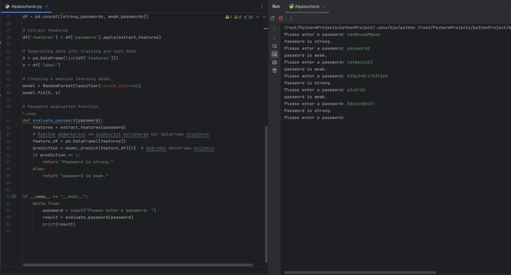

# Assessing Password Strength with Machine Learning in Python



This project is a Python script that uses machine learning techniques to assess the security level of passwords. It is developed to help users enhance their password security.

## Features

- **Data Preparation:** Utilizes `strong_passwords.txt` and `weak_passwords.txt` files to create a dataset of strong and weak passwords.
- **Feature Extraction:** Extracts features from passwords, such as length, use of uppercase/lowercase letters, digits, and special characters.
- **Model Training:** Uses the RandomForestClassifier model to predict the security level of passwords.
- **User Interaction:** Provides an interface for users to test their passwords.

## Usage

To run the project, use the following command in your terminal:

```bash
python password_strength_evaluator.py
```

The script will prompt the user to enter a password and then evaluate whether the entered password is strong or weak.

## Dataset

- `strong_passwords.txt`: Contains a list of strong passwords.
- `weak_passwords.txt`: Contains a list of weak passwords.

These files are used for training the model and are available on the GitHub page.

## Contributing

Pull requests are welcome for those who wish to contribute to the project. For significant changes, please open an issue first to discuss what you would like to change.

## License

This project is licensed under the [MIT License](LICENSE).
